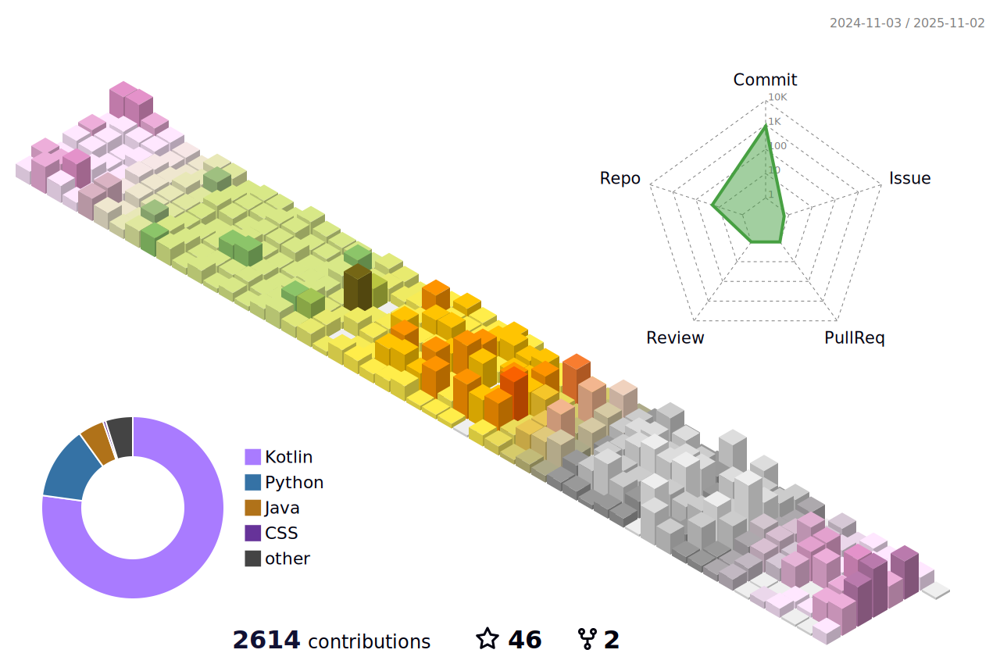

<div align="center"> 

<!-- [](https://velog.io/@ekxk1234) -->
  


</div>  
  
# <div align="center">Kotlin Backend Developer</div>  

## <div align="center"> I'm studying 2021~ </div>

<br />

<div align="center">

</div>  
  

### <div align="center">I'm cherhy, a full-time backend developer 👨‍💻 working since 2022 🚀</div>  

### My Message

```kotlin
fun main() {
    while (working()) {
        HEALTH -= 1
    }
}

var HEALTH = 365

fun working(): Boolean {
    if (HEALTH > 0) {
        return true
    } else {
        throw OutOfMemoryError("쉬면서 일을 해보는건 어때요?")
    }
}
  ```
  ---
<br/>  

```kotlin
@Transactional(noRollbackFor = [IrreversibleAction::class])
fun life() { /* compiled code */ }

class IrreversibleAction: RuntimeException()
```

---

<div align="center">
  
</div>

<br/>
